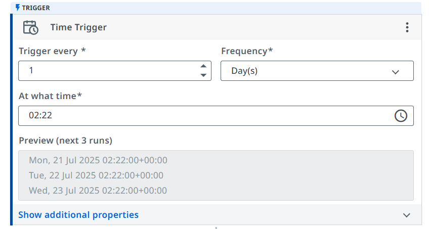
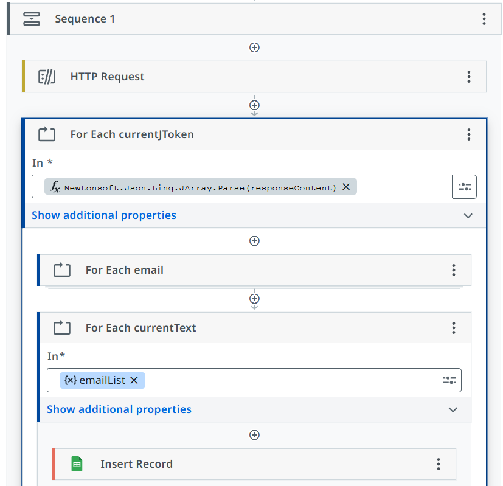
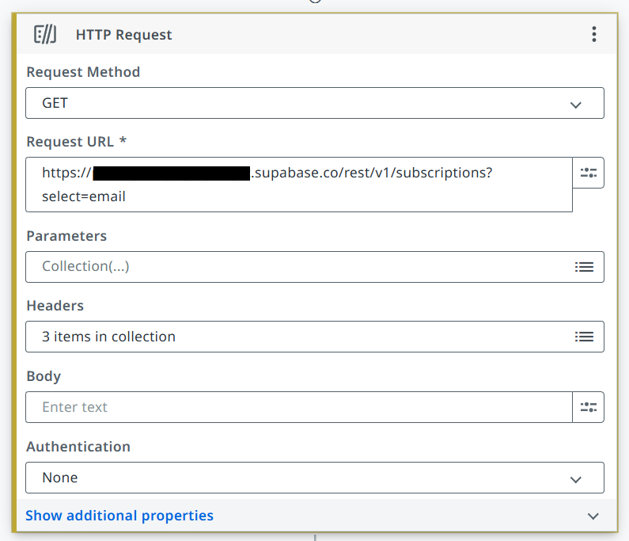
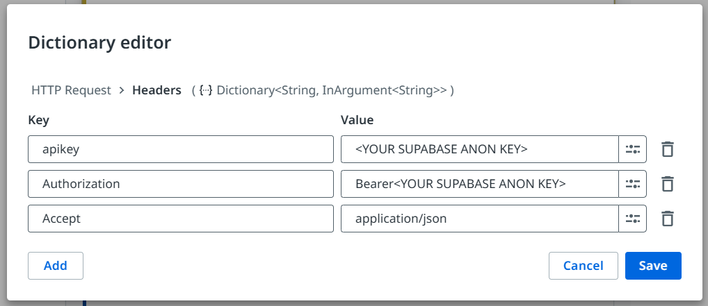
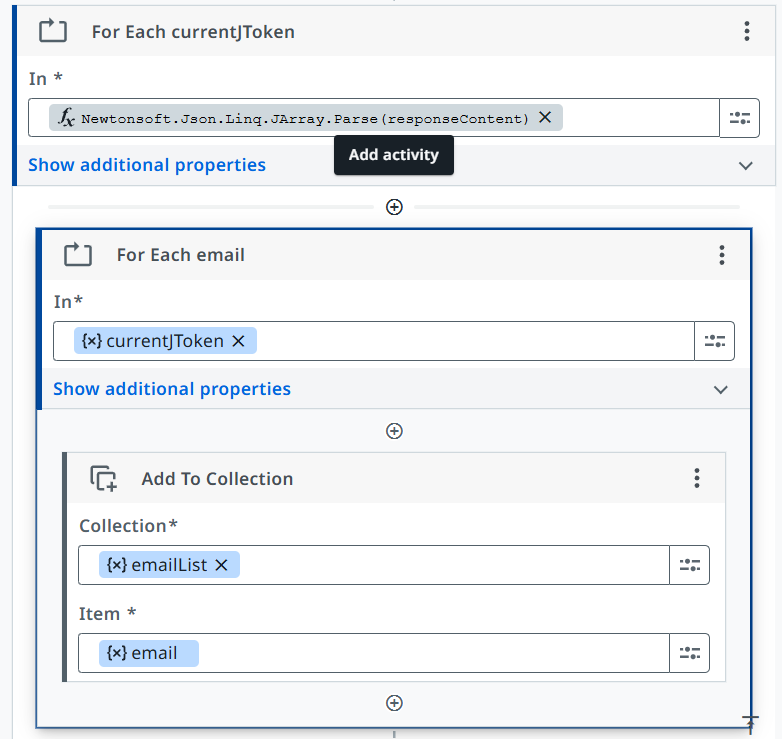

# 📬 Supabase to Google Sheets – Daily Email Sync (RPA)

  
  

---

## 🚀 Project Overview

This automation workflow built in **UiPath Studio Web** automatically syncs daily email addresses from a Supabase database into a Google Sheet.

---

## 🛠️ Tech Stack & Tools

- **UiPath Studio Web** – RPA platform  
- **Supabase REST API** – database access  
- **Google Sheets API** – spreadsheet manipulation via service account  

---

## 🔧 Step-by-step Workflow Breakdown

### 1️⃣ Daily Trigger  
Setup a scheduled trigger to run the workflow once every 24 hours.  
  
*Automates the daily execution.*

---

### 2️⃣ Main Sequence  
Organize the process steps within a single sequence.  
  

---

### 3️⃣ HTTP Request: Fetch Emails from Supabase  
Make an authenticated GET request to Supabase REST API to retrieve emails.  
  
> **Note:** Sensitive keys are hidden for security.

---

### 4️⃣ HTTP Headers  
The request contains essential headers: `apikey`, `Authorization`, and `Accept`.  
  
> **Note:** Replace with your anon key.

---

### 5️⃣ Process Emails with ForEach Loop  
Iterate through the JSON response and extract each email.  
  

---

### 6️⃣ Insert Emails into Google Sheets  
Add each email as a new record into the Google Sheet using the Google Sheets activity.  
  

---

## ⚙️ How to Reproduce

1. Create a Supabase project and a `subscriptions` table with columns `id` and `email`.  
2. Prepare a Google Sheet with a header `EMAIL` in cell A1.  
3. Enable Google Sheets API and create a Service Account; download its JSON key.  
4. In UiPath Studio Web:  
   - Create a daily time trigger  
   - Add HTTP Request with your Supabase API key and URL  
   - Parse the response and iterate emails  
   - Use `Insert Record` activity with Google Sheets connected via Service Account  
5. Test your workflow and deploy.

---

## 🔐 Security Notes

- **Never commit API keys or Service Account JSON files publicly.**  
- Always redact sensitive data in screenshots and shared files.

---

## 📄 License

This project is licensed under the [MIT License](LICENSE).

---

## 🙋‍♂️ Author 
🌐 [Andrea Martina](https://andreamartina.vercel.app)  
📧 [LinkedIn](https://www.linkedin.com/in/andmar-7137a41aa)
